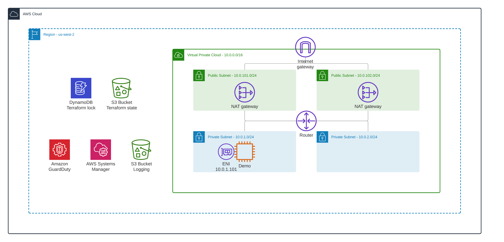

<!-- BEGIN_TF_DOCS -->

# Base infrastructure - VPC, subnets, EC2 instance, Logging S3 bucket 

This is a demo repository for the [How to inspect VPC, subnet, and EC2 instance traffic in AWS](https://hands-on.cloud/how-to-inspect-vpc-subnet-and-ec2-instance-traffic-in-aws/) article.

This module sets up the following AWS services:

* VPC (2 private, 2 public subnets, NAT Gateway)
* Demo EC2 instance
* Systems Manager - Session Manager (to manager EC2 instances)
* Amazon Guard Duty
* Logging S3 bucket (to store VPC Flow Logs)



## Deployment

```sh
terraform init
terraform plan
terraform apply -auto-approve
```

## Tier down

```sh
terraform destroy -auto-approve
```
## Providers

| Name | Version |
|------|---------|
| <a name="provider_aws"></a> [aws](#provider\_aws) | n/a |
## Resources

| Name | Type |
|------|------|
| [aws_guardduty_detector.demo](https://registry.terraform.io/providers/hashicorp/aws/latest/docs/resources/guardduty_detector) | resource |
| [aws_iam_instance_profile.ec2_demo](https://registry.terraform.io/providers/hashicorp/aws/latest/docs/resources/iam_instance_profile) | resource |
| [aws_iam_policy_attachment.ec2](https://registry.terraform.io/providers/hashicorp/aws/latest/docs/resources/iam_policy_attachment) | resource |
| [aws_iam_role.ec2_demo](https://registry.terraform.io/providers/hashicorp/aws/latest/docs/resources/iam_role) | resource |
| [aws_instance.ec2_demo](https://registry.terraform.io/providers/hashicorp/aws/latest/docs/resources/instance) | resource |
| [aws_network_interface.ec2_demo](https://registry.terraform.io/providers/hashicorp/aws/latest/docs/resources/network_interface) | resource |
| [aws_s3_bucket.logging](https://registry.terraform.io/providers/hashicorp/aws/latest/docs/resources/s3_bucket) | resource |
| [aws_s3_bucket_public_access_block.logging](https://registry.terraform.io/providers/hashicorp/aws/latest/docs/resources/s3_bucket_public_access_block) | resource |
| [aws_ami.ubuntu_latest](https://registry.terraform.io/providers/hashicorp/aws/latest/docs/data-sources/ami) | data source |
## Outputs

| Name | Description |
|------|-------------|
| <a name="output_demo_ec2_interface_id"></a> [demo\_ec2\_interface\_id](#output\_demo\_ec2\_interface\_id) | Demo EC2 instance network interface (ENI) ID |
| <a name="output_logging_s3_bucket_arn"></a> [logging\_s3\_bucket\_arn](#output\_logging\_s3\_bucket\_arn) | Logging S3 Bucket ARN |
| <a name="output_logging_s3_bucket_name"></a> [logging\_s3\_bucket\_name](#output\_logging\_s3\_bucket\_name) | Logging S3 bucket name |
| <a name="output_private_subnets"></a> [private\_subnets](#output\_private\_subnets) | VPC private subnets' IDs list |
| <a name="output_vpc_id"></a> [vpc\_id](#output\_vpc\_id) | VPC ID |

<!-- END_TF_DOCS -->