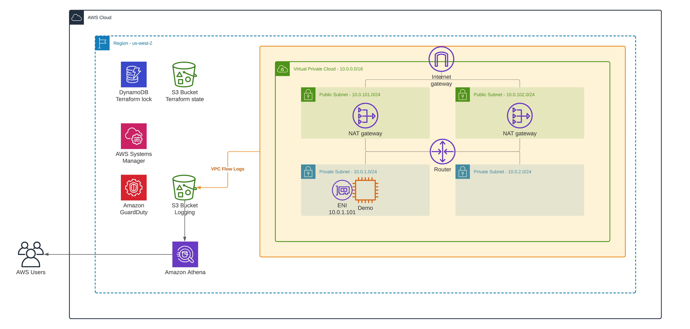

# Query VPC Flow Logs Using Athena 

This is a demo repository for the [How to inspect VPC, subnet, and EC2 instance traffic in AWS](https://hands-on.cloud/how-to-inspect-vpc-subnet-and-ec2-instance-traffic-in-aws/) article.

This module sets up the following AWS services:

* Logging S3 Bucket
* Amazon Athena



## Deployment

```sh
terraform init
terraform plan
terraform apply -auto-approve
```

## Tier down

```sh
terraform destroy -auto-approve
```
