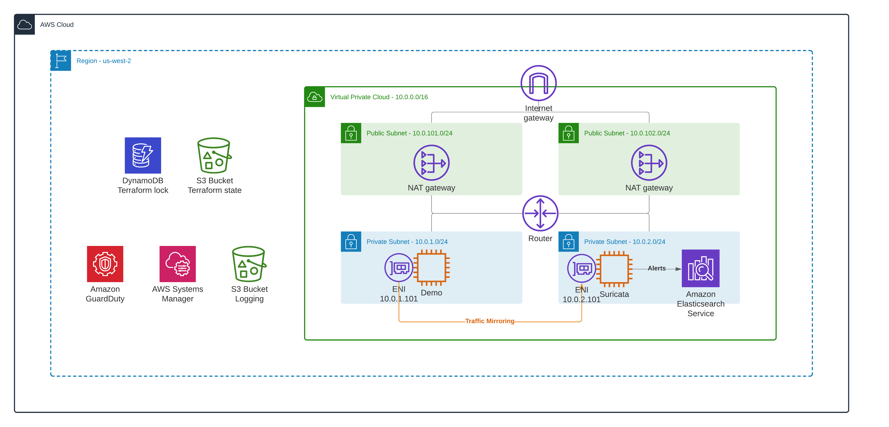

<!-- BEGIN_TF_DOCS -->

# Enabling traffic mirroring from Demo EC2 instance to Suricata EC2 instance 

This is a demo repository for the [How to inspect VPC, subnet, and EC2 instance traffic in AWS](https://hands-on.cloud/how-to-inspect-vpc-subnet-and-ec2-instance-traffic-in-aws/) article.

This module sets up the following AWS services:

* EC2



## Deployment

```sh
terraform init
terraform plan
terraform apply -auto-approve
```

## Tier down

```sh
terraform destroy -auto-approve
```
## Providers

| Name | Version |
|------|---------|
| <a name="provider_aws"></a> [aws](#provider\_aws) | n/a |
| <a name="provider_terraform"></a> [terraform](#provider\_terraform) | n/a |
## Resources

| Name | Type |
|------|------|
| [aws_athena_workgroup.vpc_flow_logs](https://registry.terraform.io/providers/hashicorp/aws/latest/docs/resources/athena_workgroup) | resource |
| [aws_ec2_traffic_mirror_filter.filter](https://registry.terraform.io/providers/hashicorp/aws/latest/docs/resources/ec2_traffic_mirror_filter) | resource |
| [aws_ec2_traffic_mirror_filter_rule.https](https://registry.terraform.io/providers/hashicorp/aws/latest/docs/resources/ec2_traffic_mirror_filter_rule) | resource |
| [aws_ec2_traffic_mirror_session.demo_ec2](https://registry.terraform.io/providers/hashicorp/aws/latest/docs/resources/ec2_traffic_mirror_session) | resource |
| [aws_ec2_traffic_mirror_target.suricata](https://registry.terraform.io/providers/hashicorp/aws/latest/docs/resources/ec2_traffic_mirror_target) | resource |
| [aws_caller_identity.current](https://registry.terraform.io/providers/hashicorp/aws/latest/docs/data-sources/caller_identity) | data source |
| [terraform_remote_state.base](https://registry.terraform.io/providers/hashicorp/terraform/latest/docs/data-sources/remote_state) | data source |
| [terraform_remote_state.suricata](https://registry.terraform.io/providers/hashicorp/terraform/latest/docs/data-sources/remote_state) | data source |
## Outputs

No outputs.

<!-- END_TF_DOCS -->