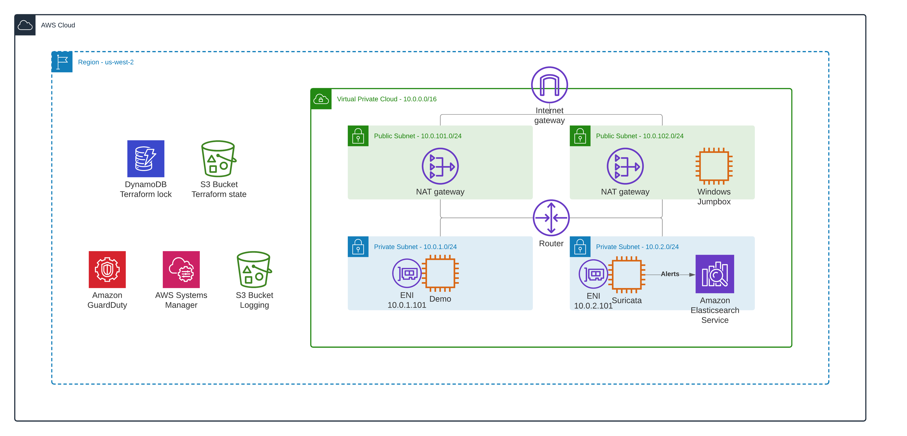

<!-- BEGIN_TF_DOCS -->

# Jumpbox Windows EC2 instance to get access to Elasticsearch Kibana 

This is a demo repository for the [How to inspect VPC, subnet, and EC2 instance traffic in AWS](https://hands-on.cloud/how-to-inspect-vpc-subnet-and-ec2-instance-traffic-in-aws/) article.

This module sets up the following AWS services:

* EC2

Google Chrome is automatically installed to the instance using [Chocolatey](https://chocolatey.org/).



## Deployment

```sh
terraform init
terraform plan
terraform apply -auto-approve
```

## Tier down

```sh
terraform destroy -auto-approve
```
## Providers

| Name | Version |
|------|---------|
| <a name="provider_aws"></a> [aws](#provider\_aws) | 3.63.0 |
| <a name="provider_terraform"></a> [terraform](#provider\_terraform) | n/a |
## Resources

| Name | Type |
|------|------|
| [aws_iam_instance_profile.ec2_windows_jumpbox](https://registry.terraform.io/providers/hashicorp/aws/latest/docs/resources/iam_instance_profile) | resource |
| [aws_iam_policy_attachment.ec2](https://registry.terraform.io/providers/hashicorp/aws/latest/docs/resources/iam_policy_attachment) | resource |
| [aws_iam_role.ec2_windows_jumpbox](https://registry.terraform.io/providers/hashicorp/aws/latest/docs/resources/iam_role) | resource |
| [aws_instance.ec2_windows_jumpbox](https://registry.terraform.io/providers/hashicorp/aws/latest/docs/resources/instance) | resource |
| [aws_network_interface.ec2_windows_jumpbox](https://registry.terraform.io/providers/hashicorp/aws/latest/docs/resources/network_interface) | resource |
| [aws_security_group.rdp](https://registry.terraform.io/providers/hashicorp/aws/latest/docs/resources/security_group) | resource |
| [aws_caller_identity.current](https://registry.terraform.io/providers/hashicorp/aws/latest/docs/data-sources/caller_identity) | data source |
| [terraform_remote_state.base](https://registry.terraform.io/providers/hashicorp/terraform/latest/docs/data-sources/remote_state) | data source |
## Outputs

| Name | Description |
|------|-------------|
| <a name="output_public_ip"></a> [public\_ip](#output\_public\_ip) | Windows Jumpbox public IP address for RDP connections |

<!-- END_TF_DOCS -->