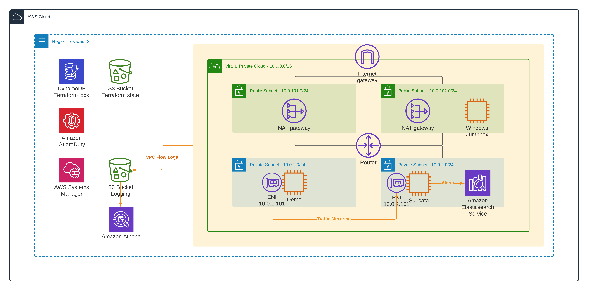

# How to inspect VPC, subnet, and EC2 instance traffic in AWS 

This is a demo repository for the [How to inspect VPC, subnet, and EC2 instance traffic in AWS](https://hands-on.cloud/how-to-inspect-vpc-subnet-and-ec2-instance-traffic-in-aws/) article.

This repository will help you to set up the following AWS services:

* Demo VPC
* GuardDuty
* Athena
* Suricata
* Elasticsearch

to configure VPC Flow Logs, traffic mirroring, alerting and monitoring using Terraform. 

Apply the following Terraform modules in order to build end-to-end infrastructure described in the article.

Every Terraform module contains its own README file and architecture diagram.
